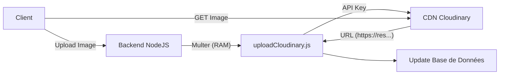
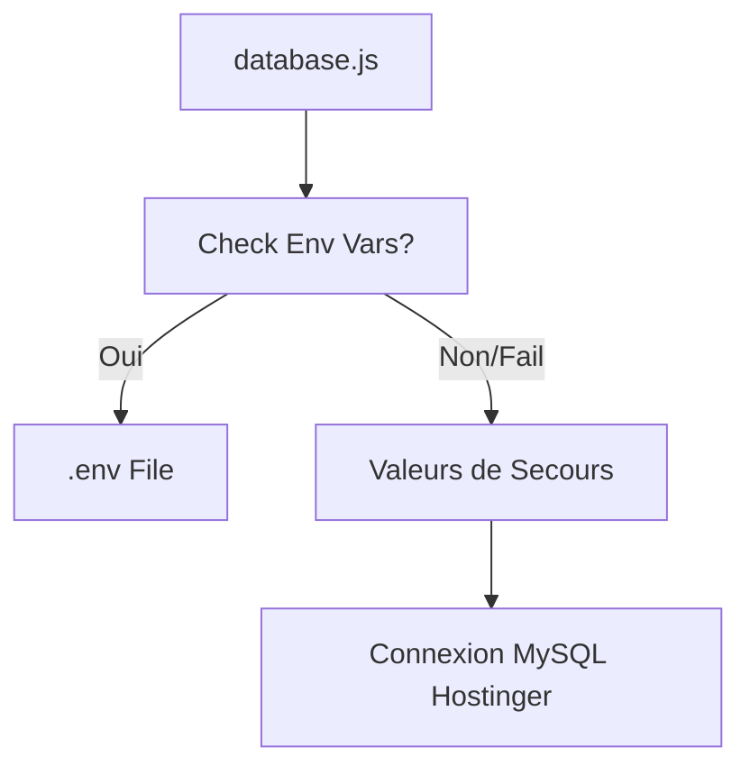

# 🏗️ Architecture du Projet & État des Lieux (e-Assime)

**Date de mise à jour :** 09 Février 2026
**Statut :** ✅ Opérationnel (Production Hostinger)

Ce document détaille l'architecture technique actuelle, les technologies utilisées et la configuration spécifique mise en place pour la production sur Hostinger.

---

## 1. 🛠️ Stack Technologique

### **Frontend (Interfaces Utilisateur)**
- **User Panel :** React.js (Vite) - Pour les boutiques et les clients finaux.
- **Admin Panel :** React.js (Vite) - Pour les administrateurs de la plateforme.
- **Style :** TailwindCSS (supposé/utilisé).

### **Backend (API Serveur)**
- **Runtime :** Node.js
- **Framework :** Express.js
- **Sécurité :** Helmet, CORS, Rate Limit.
- **Authentification :** JWT (Json Web Token).

### **Base de Données**
- **SGBD :** MySQL (Hébergé sur Hostinger).
- **Driver :** `mysql2`.
- **Compatibilité :** Le code utilise une couche d'abstraction qui imite PostgreSQL (syntaxe `$1`, `RETURNING`, etc.) pour maintenir la compatibilité avec l'ancien code tout en tournant sur MySQL.

### **Stockage / Media (Nouveau !)**
- **Service :** Cloudinary.
- **Rôle :** Hébergement persistant des images (Produits, Logos, Bannières).
- **Raison :** Remplace le stockage disque local qui était effacé lors des redémarrages serveur.

---

## 2. 🏛️ Architecture & Flux de Données

### **Flux d'Upload d'Images (Cloudinary)**
C'est la partie que nous avons modifiée récemment pour garantir la persistance.



### **Connexion Base de Données (Hostinger)**
Configuration hybride pour assurer la stabilité.



---

## 3. ⚙️ Configuration Spécifique (Production Hostinger)

Pour contourner les problèmes de lecture de variables d'environnement sur le serveur de production, nous avons appliqué les configurations suivantes :

### **A. Base de Données (`server/src/config/database.js`)**
Le fichier contient une configuration de "secours" (fallback) qui prend le relais si le fichier `.env` n'est pas lu correctement.

- **Hôte :** `localhost` (Requis pour Hostinger, au lieu de 127.0.0.1 ou IP externe).
- **Utilisateur :** `u980915146_admin`
- **Base :** `u980915146_assimedb`
- **Port :** `3306`

### **B. Cloudinary (`server/src/middleware/uploadCloudinary.js`)**
Les identifiants sont inscrits **en dur** dans ce fichier pour éviter l'erreur `Must supply api_key`.

- **Cloud Name :** `dbjc6cloi`
- **Status :** Actif et connecté.

---

## 4. 📂 Structure des Dossiers Clés

```
kapok/
├── server/
│   ├── .env                    # Variables d'environnement (Mots de passe, Clés API)
│   ├── src/
│   │   ├── config/
│   │   │   └── database.js     # ⚠️ COEUR : Config MySQL avec fallback Hostinger
│   │   ├── middleware/
│   │   │   └── uploadCloudinary.js # ⚠️ COEUR : Gestionnaire d'upload Cloudinary
│   │   ├── controllers/
│   │   │   ├── productController.js # Sauvegarde l'URL Cloudinary, plus le fichier local
│   │   │   └── shopController.js    # Idem pour Logos/Bannières
│   │   ├── routes/             # Définition des APIs
│   │   └── index.js            # Point d'entrée serveur
│   └── test-mysql.js           # Script de diagnostic connexion DB
├── user-panel/                 # Code source Frontend Utilisateur
├── admin-panel/                # Code source Frontend Admin
└── CLOUDINARY_SETUP.md         # Guide d'installation
```

---

## 5. ✅ État des Lieux actuel

| Composant | Statut | Détails |
|-----------|--------|---------|
| **Serveur Node** | 🟢 OK | Tourne sur le port 5000. |
| **Base de Données** | 🟢 Connecté | Connexion MySQL Hostinger rétablie via `localhost`. |
| **Images** | 🟢 Persistant | Uploads redirigés vers Cloudinary. Finis les fichiers perdus. |
| **Authentification** | 🟢 OK | Login/Register fonctionnels. |
| **Environnement** | ⚠️ Hybride | Utilise `.env` + Valeurs en dur (Hardcoded) par sécurité. |

## 6. 🚀 Prochaines Étapes recommandées

1.  **Maintenance :** Si vous changez le mot de passe de la base de données, pensez à le changer dans `.env` **ET** dans `server/src/config/database.js`.
2.  **Nettoyage :** Vous pouvez supprimer le dossier `server/uploads` local sur le serveur, il ne sert plus à rien (sauf archives).
3.  **Sécurité :** À terme, essayer de faire fonctionner le `.env` sur Hostinger pour ne pas laisser les mots de passe dans le code JavaScript (`database.js`), bien que ce soit acceptable pour un projet privé dont le code n'est pas public.

---

**Document généré par l'Assistant IA - Projet Kapok.**
